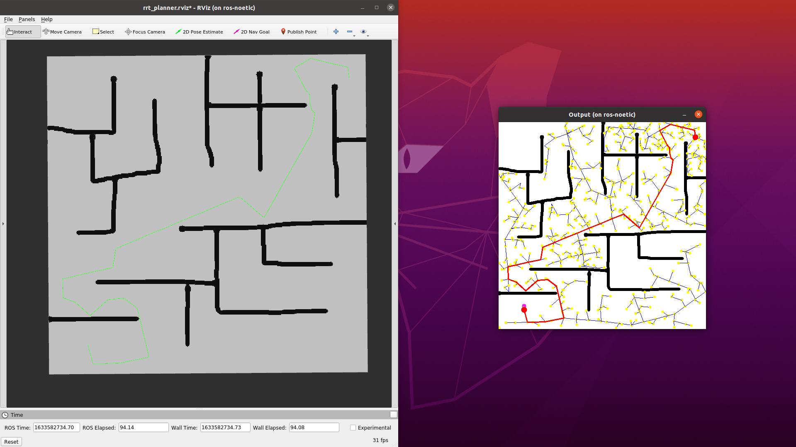

# RRT for Path Planning in ROS

## The Task
Rapidly Exploring Random Trees (RRT) algorithm to plan collision-free paths in a 2D environment.

## How to run it?
Place it in your catkin workspace `src` folder and build it using:
```bash
catkin build
```

You can run the launch file given in the `launch` folder using:
```bash
roslaunch rrt_planner rrt_planner.launch
```

This launch file automatically launches three nodes:
- **RViz** For visualization
- **Map Server** to load a map from a .png file and publish it as a `nav_msgs::OccupancyGrid` on the `/map` topic
- **RRT Planner** to receive a map, initial pose, and goal pose, and calculate and publish a collision-free path as a `nav_msgs::Path` msg

### Loading Image 
To choose which image to load, provide an image path through [cfg/map.yaml](cfg/map.yaml).

### Initial and Goal Pose 
Press the `2D Pose Estimate` button in RViz to set the initial pose. Press the `2D Nav Goal` button in RViz to set the goal pose.

### Visualization
By default, visualization is on. To turn off visualization, go to rrt_planner.h and set the VIS macro to 0.

### Sample run


#### Map Server
The map server node is responsible for loading a map file and publishing it as a `nav_msgs::OccupancyGrid` on the `/map` topic.
Certain map parameters can be tuned in the [cfg/map.yaml](cfg/map.yaml) file. By default, black pixels are considered obstacles.
The parameter negate can be used to change white pixels to obstacles.

#### RViz
When a map has been loaded successfully it should be visible in RViz. 

## Tuning
Certain RRT parameters such as max number of vertices, max step size, and goal radius can be configured at the [cfg/config.yaml](cfg/config.yaml) file.


